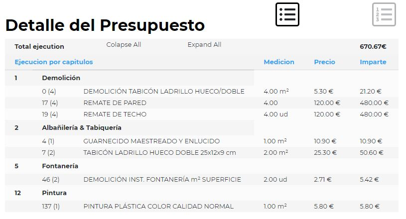
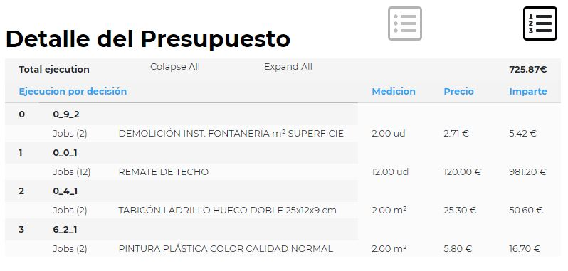

# Task_09-ResultsTable

1. Prepare and share with us test project of Yours on github
2. Fetch data from file (results.json) included in this repo, or serve data from prepared by Yourself rest API (add instructions to README.md how to run server)
3. Design and prepare a table as a component containing data from attached json file: results.json
4. Use chapter descriptions/title from the table below

| id_chapter | name |	name_es |
| --- | --- | --- |
| 0	| Demolition |	Demolición |
| 1	| Masonry & Walls |	Albañilería & Tabiquería |
| 2	| Insulation |	Aislamiento |
| 3	| Waterproofing |	Impermeabilización |
| 4	| Plumbing |	Fontanería |
| 5	| Heating & Cooling |	Climatización |
| 6	| Electricity & Lighting |	Electricidad & Iluminación |
| 7	| Ceiling |	Techo |
| 8	| Wall and floor tiling |	Solados y Alicatados |
| 9	| Windows |	Ventanas |
| 10	| Wood carpentry |	Carpintería de madera |
| 11	| Painting |	Pintura |
| 12	| Kitchen room |	Cocina |
| 13	| Others |	Varios |

6. Present data in a nice, but clear way (using external CSS library is allowed). Try to add interactions to the table (tooltips, animations).
7. Display values with units, price and sum (value X price X coef) in columns. Check all calculations afterwards.
8. Group jobs with the same id in rows (do not repaeat the same jobs) and sum up sums of theirs in last column. Sum up theirs sums.
9. Calculate and show somewhere in the table overall sum of all sums.
10. Add sorting options (by clicking on icons) to give posibility to sort jobs by chapter: "id_chapter", decision: "dec_id", sum: "sum"
11. Do not be influenced by attached images below (they are just for reference). Ignore values shown on the images. You can use Your own layout, colors, CSS props, and overall design.

push finished project to Your github and share the repo with us (with github user: shoshonstudio)

